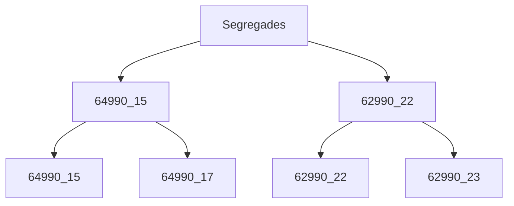

# Resum de la reunió de socis o relacionats  el 31/05/2025 19:30

Aquest és un resum fet per mi, no es tracta d'un acta, i poden haver certes malinterpretacions, a qui li arribe aquest document ha de tindre present aquest fet. En la mida d'allò possible no contindrà dades personals o estaran anonimitzades. Conté informació de la reunió i d'altra que he anat afegint per tal d'aclarar-me jo mateix.

## Assistents

* Vin1
* Vin3
* Vin5
* Vin2(segregada)
* Mor1(segregada)
* Mar5
* Mar9
* Mar15
* Mar8
* Rib3
* Rib7
* Cos4
* Pla4
* Saf2

## No assitents (sense saber si han estat convocats)

* Vin7
* Vin2b(segregada)
* Vin4
* Vin6
* Mar1(segregada)
* Mar7
* Pla6

## Contingut

Esta reunió es planteja com a informativa entre membres de l'associació, referida de diverses maneres com a "societat civil" o potencialment una "comunitat de béns". L'objectiu principal de la reunió és proporcionar informació i permetre als membres reflexionar sobre qüestions importants abans d'una futura assemblea on es prendran decisions.

Es discuteixen diversos temes crítics, principalment al voltant de la situació legal i administrativa de l'associació:

### Falta de documentació

Un problema important i recurrent és la falta de documentació necessària per part dels membres. Si bé 15 persones han presentat documentació, cal arribar a 27 membres (23 originals + 1 adherit nou + 1 participant en orige no inclòs en escriptura + 2 derivats de dos reparcelacions) per a la legalització. La falta d'informació sobre les escriptures i estatuts o contractes actualitzats és un obstacle significatiu. Sense la documentació d'identificació adequada, els membres no poden ser reconeguts legalment, cosa que dificulta la capacitat de l'associació per a funcionar o prendre decisions.

### Situació legal poc clara

Hi ha una confusió i un debat significatius pel que fa a la classificació legal de l'associació. Si bé una escriptura, encara per divulgar, l'identifica com a societat civil, el seu NIF actual és per a una comunitat de béns. Este desajust va sorgir perquè la normativa va canviar al voltant de 2016, i l'associació no va actualitzar el seu registre o NIF dins del termini establert, incorrent suposta i potencialment en sancions.
> [!warning]
> quina normativa fa referència a l'actualaització i les sancions?

### Risc de sancions i responsabilitat personal

L'actual falta de legalització adequada i el registre obsolet exposen l'associació i els seus membres a riscos. Les autoritats com ara Hisenda, Cadastre o Registre de la Propietat podrien investigar i imposar sancions. També hi ha preocupació per la responsabilitat personal pels deutes. En una "comunitat de béns", la responsabilitat és personal, mentre que per a una "societat civil", podria ser diferent, encara que això està per determinar.

Què diu el Codi Civil respecte de la [responsabilitat](https://www.boe.es/buscar/act.php?id=BOE-A-1889-4763&p=20250103&tn=1#art1698)? "Los socios no quedan obligados solidariamente respecto de las deudas de la sociedad" [Responsabilitat sobre deutes i sancions via CodiCivil + IA](20250531RespSocis.md)

### Socis no documentats

Sembla ser que no seran convocats a noves reunions donada la seua falta d'identificació.

> [!Tip]
> Això no pareix haver segut un impediment per a recolectar l'última aportació econòmica.

La Junta demana les escriptures de cada parcel·la com a prova de propietat. Però trobe dos inconvenients en l'aportació d'escriptures:
- Per una banda contenen molta informació personal prescindible per a demostrar propietat.
- Per altra banda demostren que s'ha segut propietari però no si s'és en l'actualitat, hauria de ser una certificació registral o una nota simple però té un cost associat. Altres possibilitats però que no tenen eixa força provatòria serien el rebut d'IBI urbana, cartificació cadastal i la declaració de l'IRPF.

### Socis no documentats i que no han fet l'última aportació

No es va tractar

### Incapacitat per a funcionar legalment

Degut a la situació legal no resolta i la falta de registre actualitzat, l'associació actualment no pot dur a terme accions administratives.

### Parcel·les segregades

Algunes parcel·les originals s'han dividit (segregat) al llarg del temps. Segons estatuts més antics, la segregació requeria notificació a la societat. Açò crea ambigüitat respecte als drets i responsabilitats dels propietaris de parcel·les segregades, particularment pel que fa als drets de vot i les quantitats de contribució. Un notari, <mark>sense cap aportació documental </mark>, hauria afirmat que, independentment de la segregació, cada parcel·la original només té un vot. Hi ha debat sobre si les contribucions s'han de basar en la contribució de la parcel·la original o en la superfície actual.

### Aportacions econòmiques del socis

Segons els antic estatuts les aportacions serien proporcionals a la quota de participació. I quina és la quota de participació segons la meua documentació dels socis originals?
| Nom   | fanecades  | actual? |
|-------|------------|------------|
| JNL   | 2.00 |
| FAB   | 2.00 |
| EML   | 2.50 |
| TAS   | 1.25 | 62990_03
| ADRZ  | 1.25 |
| AMM   | 1.25 |
| AEC   | 2.00 |
| MGM   | 1.00 |
| EYJBN | 1.75 |
| MRR   | 2.00 |
| MBM   | 2.00 |
| RBV   | 1.50 |
| MAB   | 1.50 |
| FVB   | 1.50 |
| JAB   | 1.50 |
| CNN   | 1.00 |
| PVT   | 2.50 | 64990_09
| MGB   | 2.50 |
| PVA   | 2.50 |
| DML   | 1.00 |
| AML   | 1.00 |
| VTG   | 1.00 |
| **Total**  | 36.50|

Ara bé, com s'ha estat pagant els últims anys? per quotes unitàries, i és correcte? d'acord a estatut de 1977 No! però caldrà revisar nova documentació.

Quina és l'aportació última de les parcel·les segregades, doncs 1/2, o siga 50€, independent de la superfície, i es parla també del valor del vot com a 1/2.

Quines són les parcel·les segregades? Del que es comenta en la Junta i de la consulta al cadastre sense ser segurs els resultats aparenten ser:

### Problemes financers

El compte bancari de l'associació va ser bloquejat perquè no es van proporcionar dades obligatòries al banc. Van aconseguir recuperar fons utilitzant signataris antics. Actualment posseeixen fons (aprox 1200€ + 2500€) però no poden obrir un nou compte bancari fàcilment sense un registre adequat i una llista de membres actuals. Els bancs haurien aconsellat no mantenir una "societat civil" degut als costos potencialment elevats. Açò els obliga a gestionar els diners en efectiu en poder d'un membre, la qual cosa és irregular i arriscada. Hi ha deutes pendents o pagaments per serveis com la protecció de dades que també necessiten aclariment.

### Responsabilitat de l'administrador

Es tracta superficialment sense arribar a res concret.

Ara bé la normativa si té clar qui és el [responsable](20250531RespAdministrador.md), però sense administrador extern eixa responsabilitat passa a ser dels socis gestors. 

### Comunicació

Els mètodes de comunicació (com llistes de distribució unidireccionals de WhatsApp o avisos publicats només en la porta de Ribera5), no garantitzen una distribució general i transparent, és més no queda acreditació de la comunicació. Quan hi haja un canvi de responsabilitat dins la Junta, entenc que el WhatsApp és el personal i no passarà a altre membre de la Junta. 

WhatsApp o altres Apps són molt dinàmiques i vàlides per a avançar, però inapropiades des del punt de vista legal/administratiu.

### Futures reunions

Comenta la Junta que les futures reunions, especialment les de presa de decisions, només haurien d'incloure els membres que hagen presentat la documentació requerida, encara que açò és un punt de discussió.

# Conclusió

En general, la reunió destaca una situació complexa resultant de molts anys de negligència administrativa i una situació legal poc clara, que ara requereix un esforç significatiu i un procediment adequat per a resoldre's. Els passos immediats impliquen recopilar documentació i informar els membres sobre la gravetat i els detalls dels problemes abans que es puguen prendre decisions col·lectives per a legalitzar i reestructurar l'associació.